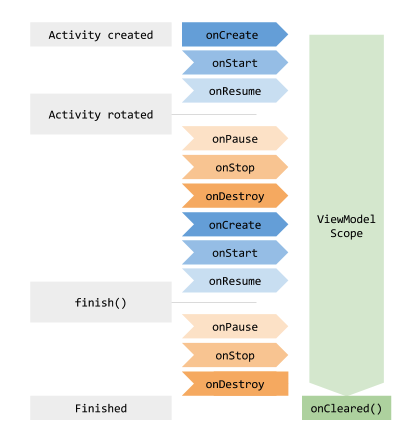

ViewModel 클래스는 Lifecycle을 고려하여 UI 관련 데이터를 저장하고 관리 할 수 있도록 설계되었다. 때문에 화면 회전과 같이 구성이 변경될 때도 데이터를 유지할 수 있다.


<!--more-->

### 개요
ViewModel 클래스는 Lifecycle을 고려하여 UI 관련 데이터를 저장하고 관리 할 수 있도록 설계되었다. 때문에 화면 회전과 같이 구성이 변경될 때도 데이터를 유지할 수 있다.   
시스템에서 UI 컨트롤러가 재생성 되는 경우, 즉 화면 회전과 같은 경우, 액티비티가 재생성 되게 되고 데이터를 다시 가져와야 할 것이다.   
데이터가 간단한 경우는 onSaveInstanceState() 메서드로 번들을 통해 데이터를 복원할 수 있지만 Serialize 과정을 거치기에 소량의 데이터에만 적합.  

발생할 수 있는 또 다른 문제는 UI 컨트롤러가 시간이 오래 걸리는 비동기 호출을 자주 할 수 있다는 점. 
  
액티비티, 프래그먼트 같은 UI 컨트롤러의 목적은 UI 데이터를 표시하거나, 사용자 인풋에 반응, 등 커뮤니케이션 처리. 그런데 여기에 DB, Network 통한 데이터 로드 까지 추가하면 클래스가 너무 커지고 코드가 길어진다.  
  
이 때문에, View 데이터 관련 부분을 분리하면 쉽고 효율적으로 구현이 가능하다는 접근.  

### 구현
AAC에는 ViewModel 클래스가 제공된다. ViewModel 객체는 구성이 변경되는 동안 자동으로 보관되므로 다음 액티비티나 프래그먼트에서 즉시 사용할 수 있다.   
예를 들어, 앱에서 사용자 목록을 표시해야되는 경우 아래와 같이 ViewModel 에 사용자 목록을 보관하도록 해야 한다. 

```java
class MyViewModel : ViewModel() {
    private val users: MutableLiveData<List<User>> by lazy {
        MutableLiveData().also {
            loadUsers()
        }
    }

    fun getUsers(): LiveData<List<User>> {
        return users
    }

    private fun loadUsers() {
        // Do an asynchronous operation to fetch users.
    }
}
```
```java
class MyActivity : AppCompatActivity() {
    override fun onCreate(savedInstanceState: Bundle?) {
        // Create a ViewModel the first time the system calls an activity's onCreate() method.
        // Re-created activities receive the same MyViewModel instance created by the first activity.

        // Use the 'by viewModels()' Kotlin property delegate
        // from the activity-ktx artifact
        val model: MyViewModel by viewModels()
        model.getUsers().observe(this, Observer<List<User>>{ users ->
            // update UI
        })
    }
}
```
액티비티가 다시 생성되면 처음 액티비티 에서 생성된 동일한 MyViewModel 객체를 받는다. 액티비티가 끝나면 리소스 정리 위해 ViewModel의 onCleared() 메서드가 호출된다.
**단, ViewModel은 View, Lifecycle, Activity context 참조를 포함하는 클래스를 참조해서는 안된다**
  
ViewModel 객체는 LiveData와 같은 LifecycleObservers 가 포함 될 수 있다. 하지만 Observerble 의 변경사항에 대한 처리를 해서는 안된다. 

### ViewModel의 수명 주기
ViewModel 객체 범위는 ViewModelProvider에 전달되는 Lifecycle로 지정된다.   
ViewModel은 Activity Lifecycle이 끝날때 까지, Fragment 분리될 때 까지 메모리에 남아있게 된다. 



일반적으로 onCreate() 메서드를 처음 호출할 때 ViewModel 을 생성. 화면 기기 회전될 때 onCreate() 여러번 호출 될 수 있고, 처음 viewmodel 생성되어서부터 액티비티 끝날 때 까지 viewmodel 은 존재하게 됨.   
  
### Fragment 간 데이터 공유
액티비티에 포함된 둘 이상의 프래그먼트는 서로 커뮤니케이션 해야 한다고 알려져 있다. 사용자가 목록에서 항목을 선택하는 프래그먼트와 선택된 항목의 콘텐츠를 표시하는 또 다른 프래그먼트가 있는 사례를 가정할때, 두 프래그먼트 모두 인터페이스를 정의해야 하고 액티비티가 두 프래그먼트를 모두 결합해야 되기 때문에 이 사례는 간단히 처리할 수 있는 작업이 아니다. 또한 두 프래그먼트 모두 다른 프래그먼트가 아직 생성되지 않았거나 표시되지 않는 시나리오도 처리해야 한다.   
이러한 문제는 ViewModel을 이용하면 해결할 수 있다. 아래 샘플코드와 같이 어플리케이션을 처리하기 위한 액티비티를 활용해 ViewModel 을 공유할 수 있다. 

```java
class SharedViewModel : ViewModel() {
    val selected = MutableLiveData<Item>()

    fun select(item: Item) {
        selected.value = item
    }
}

class MasterFragment : Fragment() {

    private lateinit var itemSelector: Selector

    // Use the 'by activityViewModels()' Kotlin property delegate
    // from the fragment-ktx artifact
    private val model: SharedViewModel by activityViewModels()

    override fun onViewCreated(view: View, savedInstanceState: Bundle?) {
        super.onViewCreated(view, savedInstanceState)
        itemSelector.setOnClickListener { item ->
            // Update the UI
        }
    }
}

class DetailFragment : Fragment() {

    // Use the 'by activityViewModels()' Kotlin property delegate
    // from the fragment-ktx artifact
    private val model: SharedViewModel by activityViewModels()

    override fun onViewCreated(view: View, savedInstanceState: Bundle?) {
        super.onViewCreated(view, savedInstanceState)
        model.selected.observe(viewLifecycleOwner, Observer<Item> { item ->
            // Update the UI
        })
    }
}
```
위의 샘플에서 보면, 두 프래그먼트 모두 자신이 포함된 activity 를 통해 동일한 SharedViewModel 인스턴스를 받는다.  
이 방법에는 아래와 같은 이점이 있다.  
- Activity는 아무것도 할 필요가 없고 위의 관계에 관여할 필요가 없다.
- Fragement 는 SharedViewModel 외에 서로 알 필요가 없다. 둘중 하나가 사라지더라도 다른 하나는 계속 평소대로 작동한다.
- 각 Fragment 는 자체 수명 주기가 있으며 다른 Fragment 수명주기에 영향을 받지 않는다. 
   
### ViewModel로 로더 대체하기
CursorLoader 와 같은 로더 클래스는 UI 데이터와 DB 간의 동기화를 유지하는데 자주 사용. ViewModel을 몇 가지 클래스와 함께 사용하여 로더를 대체할 수 있다. ViewModel을 사용하면 UI controller가 데이터 로드 작업에서 분리되어 강력한 참조가 적어진다.  
  
일반적인 로더 사용 방법중 하나로, 앱이 CursorLoader를 사용하고 DB 내용을 Observe 할 수 있다. DB 값이 변경되면 데이터를 새로고치고 UI 업데이트를 진행한다. 

  
ViewModel을 이용하게 되면 Room 과 LiveData 를 이용하여 로더를 대체한다. ViewModel은 기기 서렂ㅇ이 변경되어도 데이터가 유지되도록 한다. DB 가 변경되면 Room에서 LiveData에 변경을 노티하고 노티를 받은 LiveData는 수정된 데이터로 UI 업데이트


